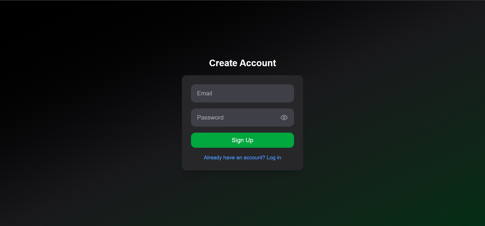
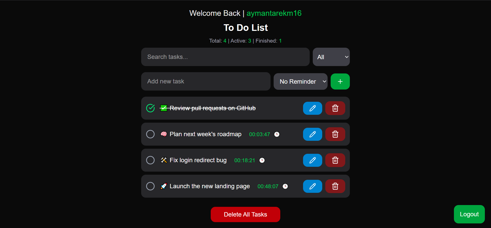

# 📝 Next.js Task Manager App

A powerful and modern task manager built with the latest technologies. It includes full authentication, smart filtering, drag-and-drop, reminders with audio/visual notifications, and persistent storage with Firebase.

---

## 🚀 Tech Stack

- **Framework**: [Next.js 15 (Turbopack)](https://nextjs.org/)
- **Styling**: [Tailwind CSS](https://tailwindcss.com/)
- **Motion & Animation**: [Framer Motion](https://www.framer.com/motion/)
- **Drag and Drop**: [dnd-kit/core](https://dndkit.com/)
- **Icons**: [Lucide React](https://lucide.dev/)
- **Authentication & Database**: [Firebase Authentication & Firestore](https://firebase.google.com/)
- **Notifications**: Custom AI-powered voice & image reminders

---

## 🔐 Features

- 🔑 **Login & Sign Up** (Firebase Auth)
- 📦 **Cloud Storage** (Firebase Firestore)
- 📂 **Real-time Task Management**
- 🎯 **Filter Tasks** (All, Active, Completed)
- 🔄 **Drag and Drop** (Reorder tasks easily)
- 🔍 **Search Tasks** (Live search by name)
- ⏰ **Smart Reminders**
  - Plays **sound and visual alert**
  - Uses AI to **speak task name & user name**
- 🌙 **Modern Dark UI**

---

## 📸 Screenshots





---

## 🛠️ Getting Started

1. **Clone the repo**  
   ```bash
   git clone https://github.com/your-username/your-repo-name.git
   cd your-repo-name
